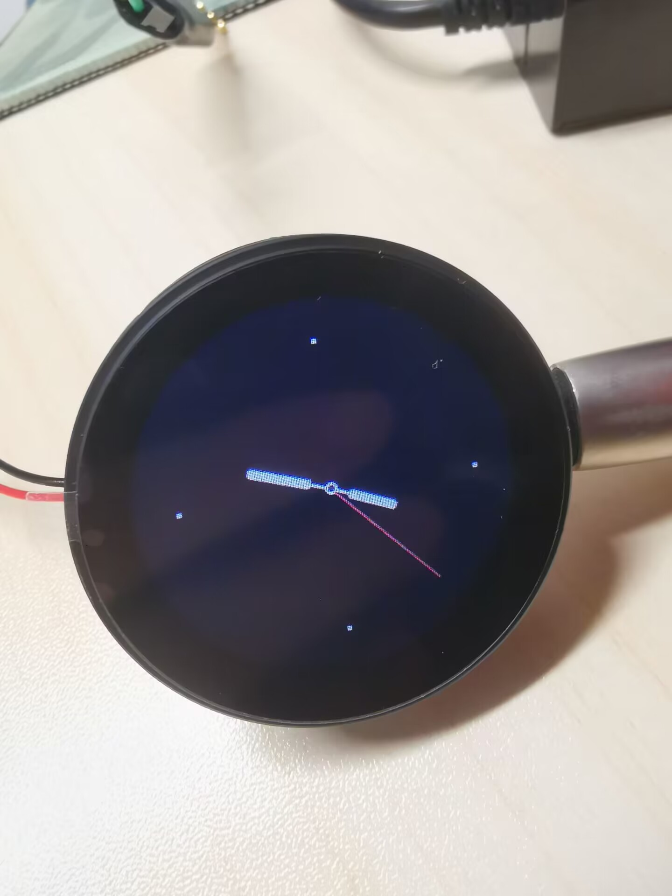
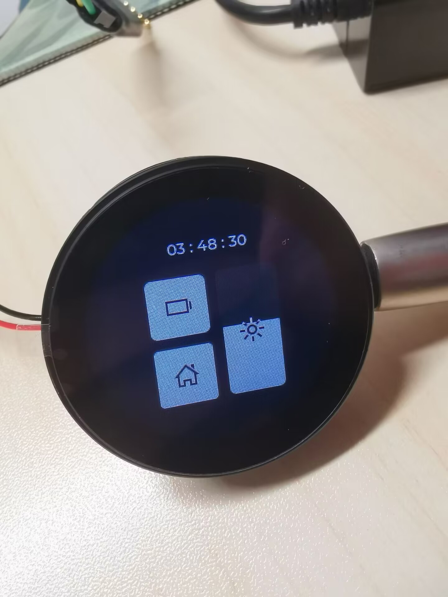
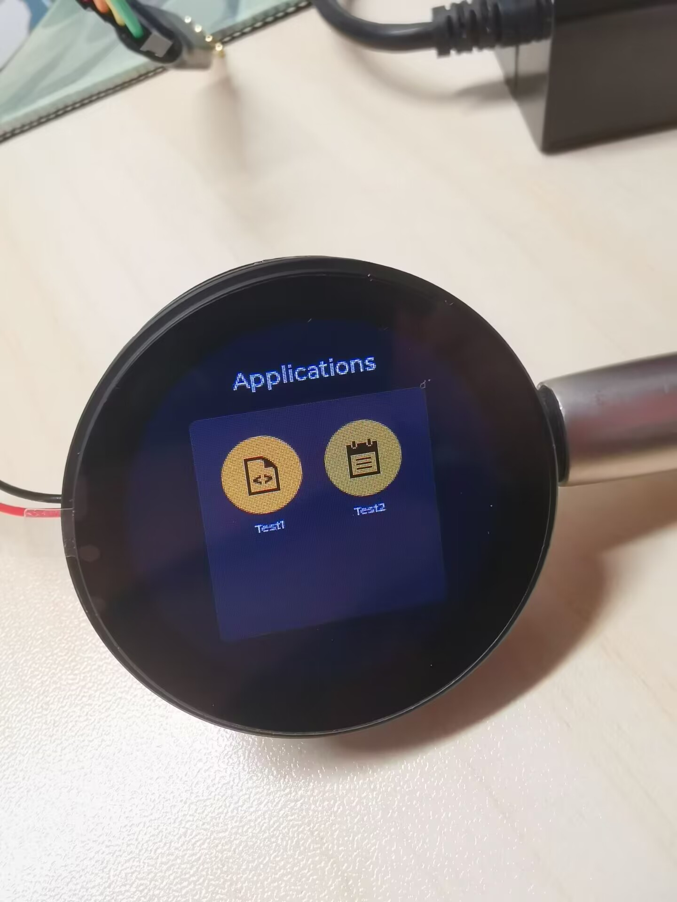
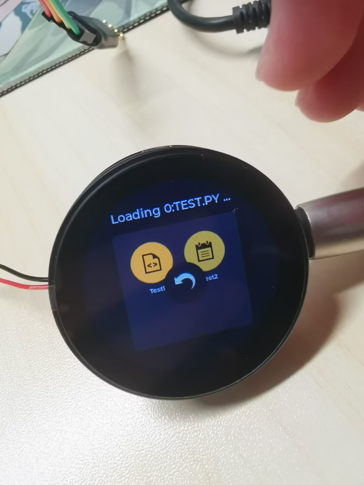
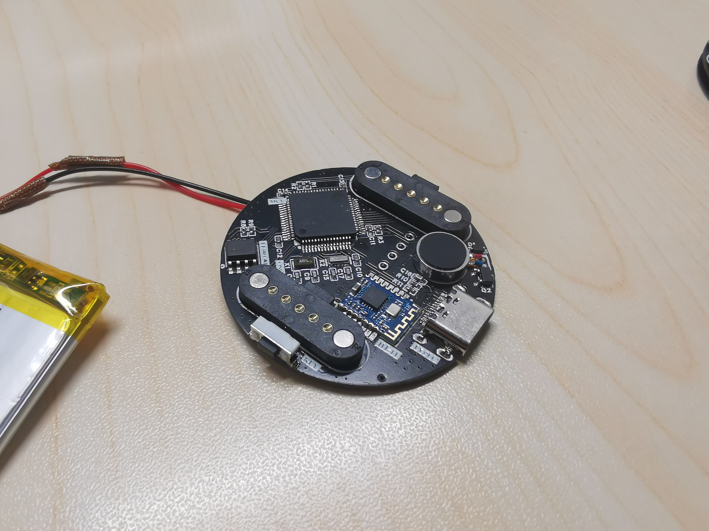
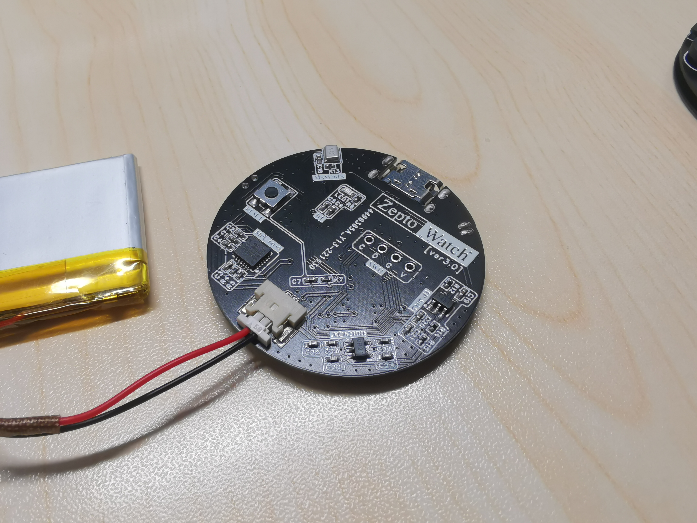
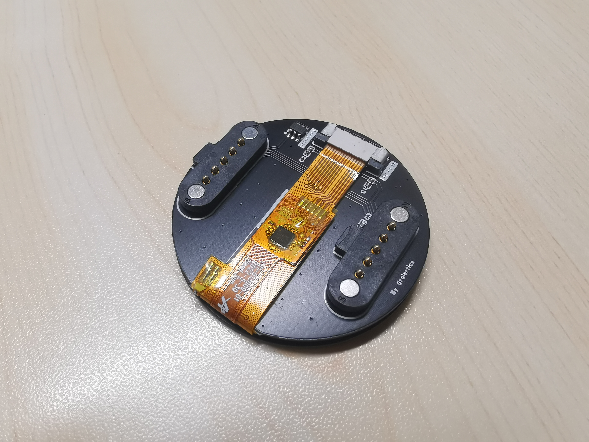
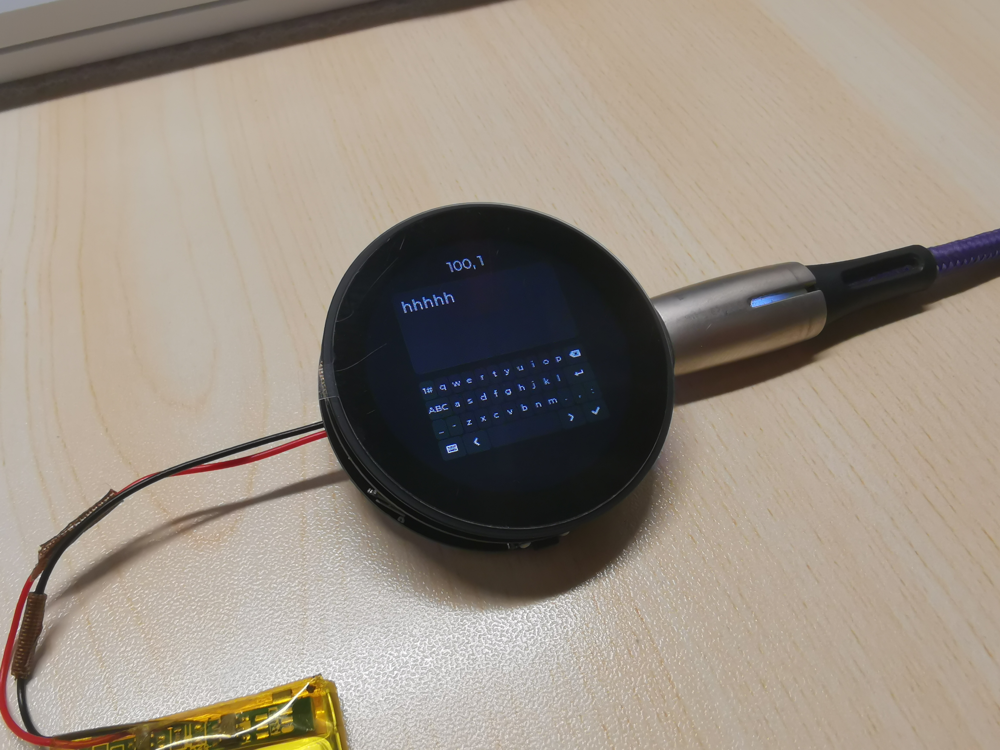

# ZeptoWatch

A smart watch based on STM32F405RGT6.

基于 STM32F405RGT6 的智能手表 / 大号手环，特点是可以执行用户编写的 Python 脚本（应用程序），并提供板上资源的 Python 库封装。
使能为 USB FS Device，设备可像 U 盘一样被识别，并且内有 FAT 文件系统，脚本直接拖入根目录即可。设备端可在应用列表以左滑手势刷新列表，固件会进行扫描。

**【Improving.】**

---

**/Documents**.

  - imgs: Shots. 一些展示图。
  - docs: Documents. 一些粗糙的 API 说明和脚本程序示例。

**/Firmware**: The firmware for ZeptoWatch.

  - UI based on LVGL. LVGL 实现的图形交互界面。
  - Drivers for peripherals on board. 驱动封装。
  - Type-C Support. Type-C 接口支持。
  - USB Mass Storage Class. 可识别为 USB 大容量存储设备。
  - FatFs on EEPROM. 在 EEPROM 上建立 FAT 文件系统。
  - Applying [PikaScript](https://github.com/pikasTech/pikascript) as a built-in interpreter. 采用 PikaScript 作为内置 Python 解释器。
  - ......

<div align="center">
    
    
    
    
</div>

**/Hardware**: PCBs & Schematics.

- Version 0.0: Test. 原型验证。

- Version 1.0: Polish up the schematics. Be not implemented. 初稿，存在问题。

- Version 2.0: There are some **mistakes** that would be modified in Ver.3.0. 第二版多处采取了一些更主流的方案，尚有一些小问题。

- Version 3.0: **Stacked design**. 第三版采用两块叠板设计。

<div align="center">
    
    
</div>

<div align="center">
    
    
</div>

- Version 4.0: Expectations. To be designed. 预期改进设计，详见第三版原理图注释。

**/Software/Scripts**: Some example scripts. 一些示例应用程序。

- BATUTIL.PY: 电源插拔检测和电池电压采样测试，字体大小变更测试。

- CALCAPP.PY: 简单的**计算器**，按钮阵列测试。

- FREQ.PY: 乱跳的**频谱显示**，麦克风、lvgl 样式、FFT (arm_math) 测试。

- LVTEST.PY: lvgl 测试，单个按钮与点击事件回调。

- MERITS.PY: **电 子 木 鱼**，内置图片资源获取、振动马达测试。

- SETTINGS.PY: 时间设置，roller 和 rtc 接口测试，设置界面已弃用改为内置。

- TEST.PY: 屏幕亮度变更、温度传感器测试。

- BALANCE.PY: 简单的**刚体模拟**小程序，用 IMU 加速度计给控件施加向下的模拟重力，顺便加了个边界反弹。

- GRAVITY.PY: BALANCE 的一个物体变为五个。

**/Structure**: Models in SolidWorks **(Just drafts, do not match the current PCB design)**. 无关的外壳设计，和实际设计的 PCB 不匹配，留档用。

---

An example script:
```python
###ICON=scripts;NAME=LightTest;COLOR=16751415###

import ZeptoWatchStdLib as zws
import ZeptoWatchPeriphLib as zwp

zwp.IMU.initialize()

i = 5
j = 1
while 1 == 1:
    zws.Display.setBrightness(i)
    if i >= 95:
        j = -1
    if i <= 5:
        j = 1
    i = i + j

    k = zwp.IMU.getTemperature()
    print(k)

    zws.System.delayMs(3)

###END###
```

The first line contains the basic information of the customized applications. Icons can be now only chosen from the built-in icons. By the way, the current implementation of the parsing method is just for testing and is very silly, so please follow the format strictly.
```python
###ICON=scripts;NAME=LightTest;COLOR=16751415###
```

The last line exists as another silly way to solve the problem of illegal characters at the end of the file when it is read by FatFs (I have temporarily no idea about where are they from. Maybe it has something to do with the fact that I edited the file by accessing the USB under Windows.).
```python
###END###
```

The output has been [retargeted](https://zhuanlan.zhihu.com/p/145801160) to USART6.
```python
print(k)
```

Drivers for resources on board are provided in the customized packages, including IMU, LCD, Microphone, etc.
```python
import ZeptoWatchStdLib as zws
import ZeptoWatchPeriphLib as zwp
```

If you want the rest of the system to be accessible at the same time, use ```ZeptoWatchStdLib.System.delayMs(time: int)``` in the script loop, which is implemented by FreeRTOS's ```osStatus osDelay (uint32_t millisec);```, in order to ensure that functions such as drop-down menus and clock ticking can remain active while the script is running.
```python
zws.System.delayMs(3)
```

A requirement from PikaScript is that all the spacing should be 4x spaces.
```python
while 1 == 1:
    zws.Display.setBrightness(i)
    if i >= 95:
        j = -1
    if i <= 5:
        j = 1
    i = i + j
```

---

Thanks for reading.
