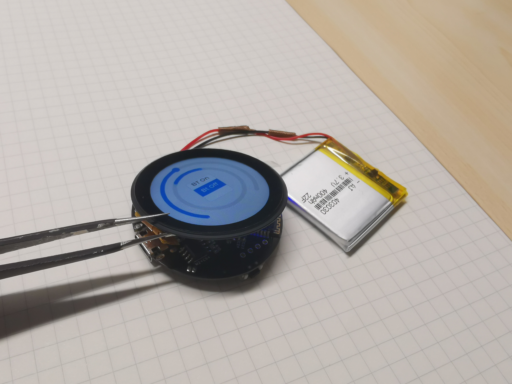
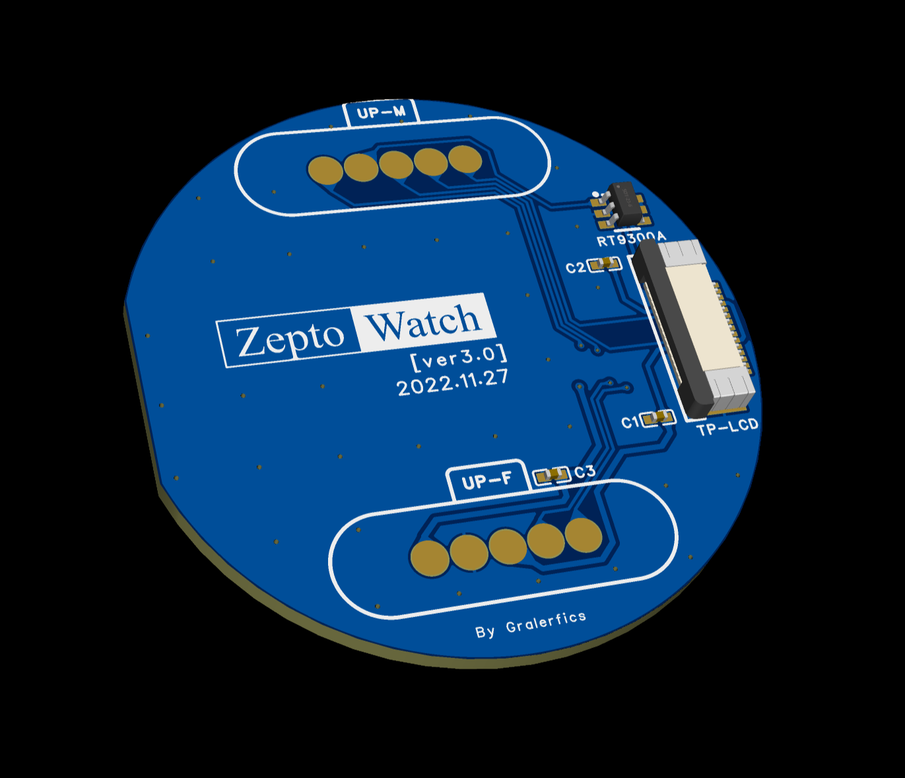
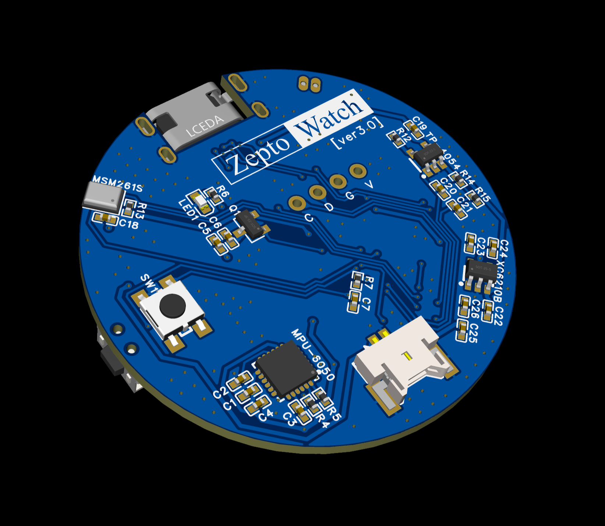
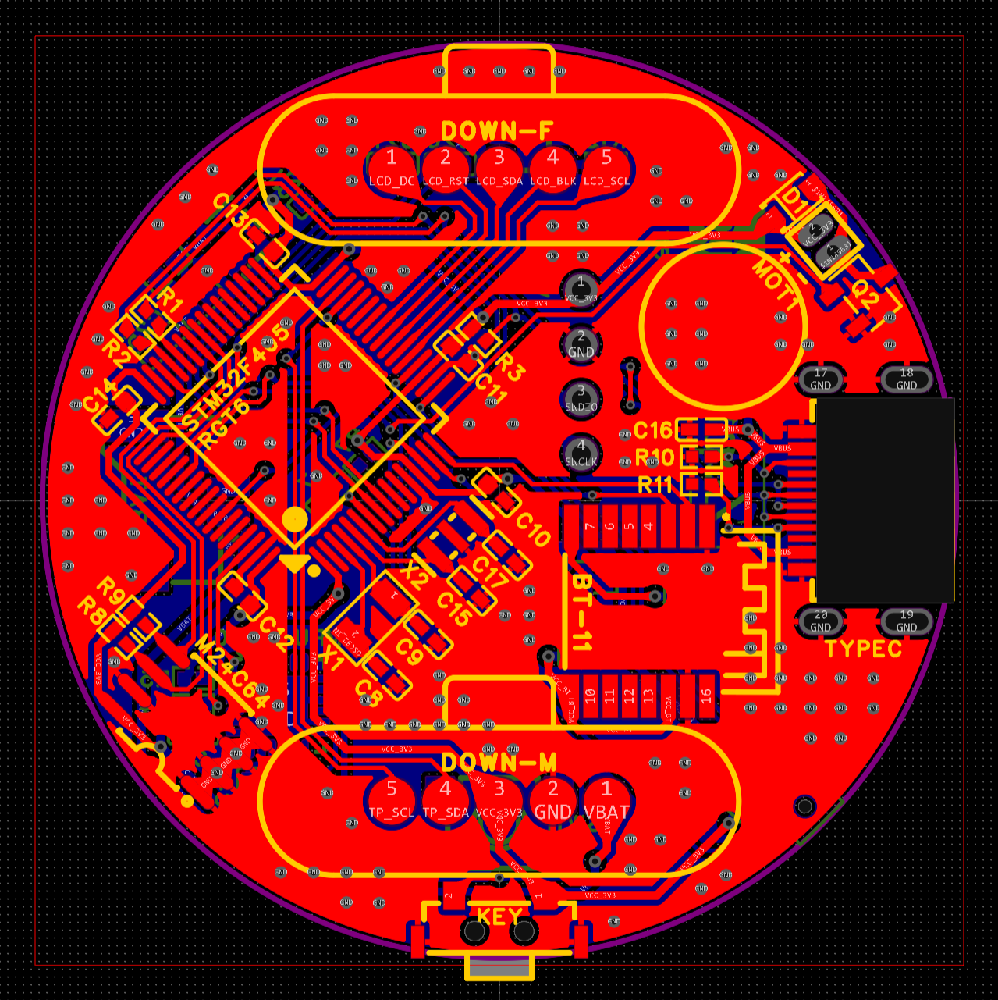

# ZeptoWatch

Smart watch based on STM32F405RGT6.

---

**/Documents**.

**/Firmware**.

**/Hardware**: PCBs & Schematics.

​		Version 0.0: Testing.

    

​		Version 1.0: Polish up the schematics. Did not implemented.

​		Version 2.0: There are some **mistakes** that would be modified in Ver.3.0.

    
    

​		Version 3.0: **Stacked**. Not yet verified.

    
    
    

**/Structure**: SLD **(Just drafts)**.
