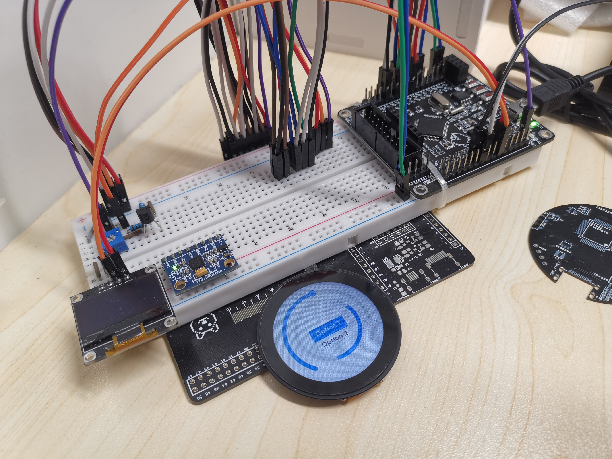
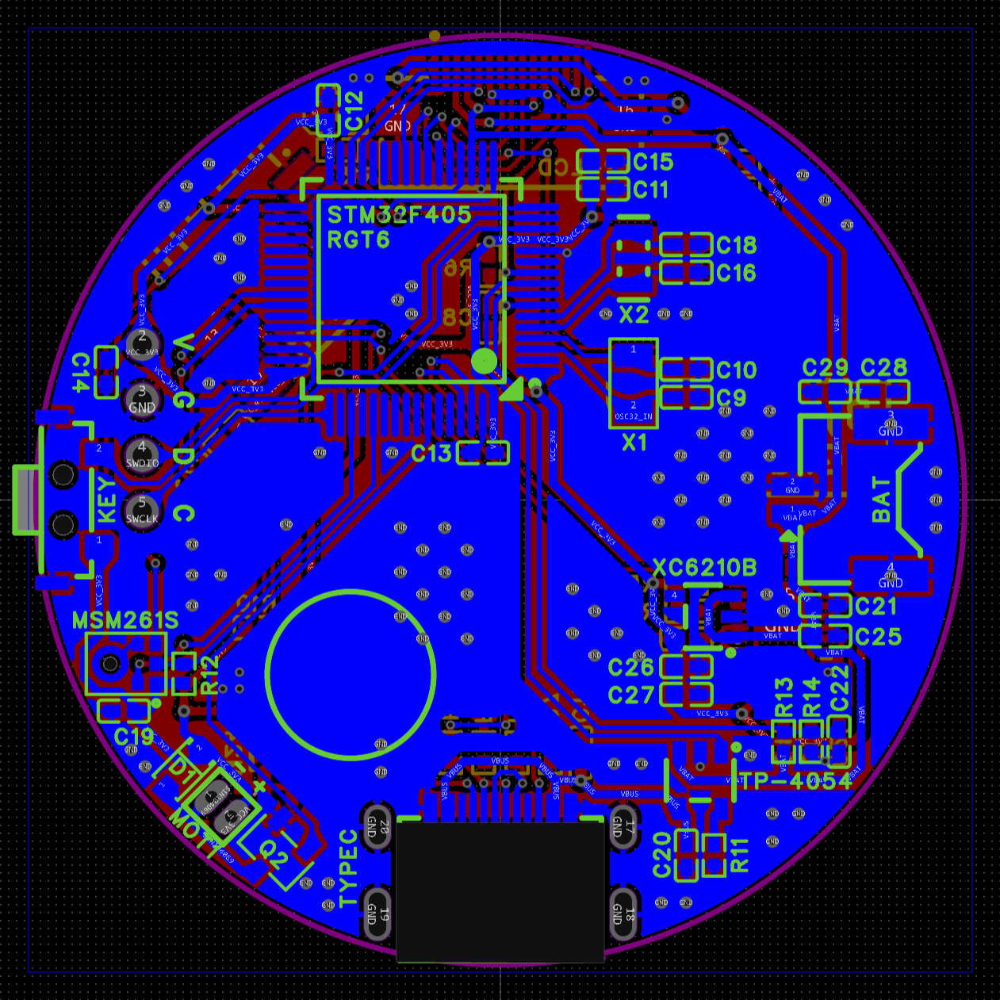

# ZeptoWatch

A smart watch based on STM32F405RGT6.

---

**/Documents**.

- imgs: Shots.

**/Firmware**.

- Firmware for ZeptoWatch (developing).

**/Hardware**: PCBs & Schematics.

- Version 0.0: Testing.

    

- Version 1.0: Polish up the schematics. Be not implemented.

- Version 2.0: There are some **mistakes** that would be modified in Ver.3.0.

    
    

- Version 3.0: **Stacked design**. Verifying.

    
    
    

    
    

    
    

**/Structure**: Models in SolidWorks **(Just drafts, do not match the current PCB design)**.

---

Thanks for reading.
